# 44688
### Author:  Uma Maheswari Subramanian
# Income Prediction in USA
## App Link : https://umams2002.shinyapps.io/incomepredictionapp/
## Overleaf Report link: https://www.overleaf.com/read/whfnhmpkgktc#296df2
## Github Code Repository link: https://github.com/umams2002/44688
## EDA process Jupyter Notebook link: https://github.com/umams2002/44688/blob/main/Code/eda_process.ipynb
## Model building Jupyter Notebook link: https://github.com/umams2002/44688/blob/main/Code/model_building.ipynb
## Raw Data source:https://github.com/umams2002/44688/blob/main/Code/adult.csv
## EDA Processed Data CSV file: https://github.com/umams2002/44688/blob/main/Data/eda_processed_adult.csv
## Best Model Pickle file: https://github.com/umams2002/44688/blob/main/Data/best_model.pkl
## Commit History: https://github.com/umams2002/44688/commits


## Description
This project predicts income levels in different regions of the
US to inform strategic business decisions, including selecting suitable
places for franchise expansion for the tax preparation. The predictive models will assist in identifying high-income areas, allowing for the selection of regions for possible franchise expansion.

This research provides valuable forecasts that can assist guide data-driven
business decisions, such as identifying places with income levels that
support franchise viability and success matters.
## Table of Contents
- [Installation](#installation)
- [Usage](#usage)
- [Deliverables](#deliverables)
- [Process Involved](#process-involved)
- [Predictive Analysis](#predictive-analysis)
- [Features](#features)
- [Key Findings](#key-finding)
- [License](#license)
- [Contact](#contact)


## Installation
Step-by-step instructions on how to install and set up your project.

### Clone the repository
git clone https://github.com/umams2002/44688

### Navigate to the project directory
cd 44688

### Install python latest version
install --py
py --version

### Create and activate environment
py -m venv ds-venv
ds-venv\Scripts\Activate

### Install dependencies
pip install -r [requirements.txt]

## Usage
This project is used for Franchise expansion and Business expansion proposals. It provides valuable forecasts and insights to assist in making data-driven business decisions. Follow the steps below to use the project:

### Running the Project
1. **Activate the virtual environment**:
   ```bash
   ds-venv\Scripts\Activate

## Deliverables

### App Link : https://umams2002.shinyapps.io/incomepredictionapp/
### Overleaf Report link: https://www.overleaf.com/read/whfnhmpkgktc#296df2
### Github Code Repository link: https://github.com/umams2002/44688

##  Process Involved
##  Data Cleaning and Preprocess
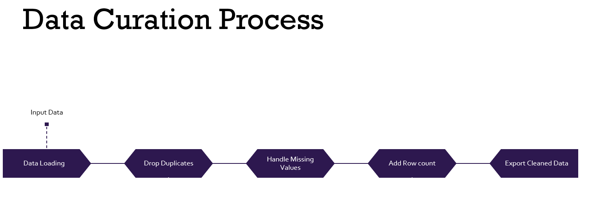

##  EDA Process
These are the steps involved in the EDA process
1. Project preparation and Import Libraries
2. Data Acquisition (Load Dataset) and Inspection
3. Data Cleaning and Preparation (or Data Prepossessing)
4. Initial Descriptive Statistics
5. Initial Data Distribution for Numeric Columns
6. Initial Data Distribution for Category Columns
7. Initial Visualizations
8. Initial Storytelling and Presentation
EDA jupyter notebook link:  https://github.com/umams2002/44688/blob/main/Code/eda_process.ipynb
https://github.com/umams2002/44688/blob/main/Code/InitialVisual.ipynb

Initial Visuals:

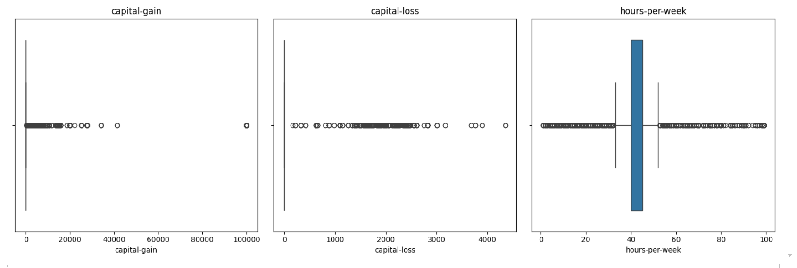 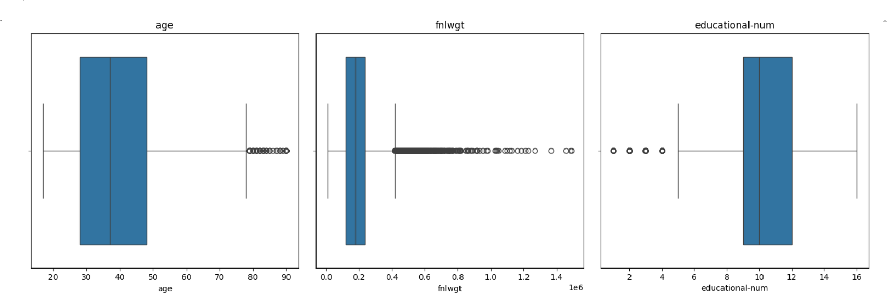
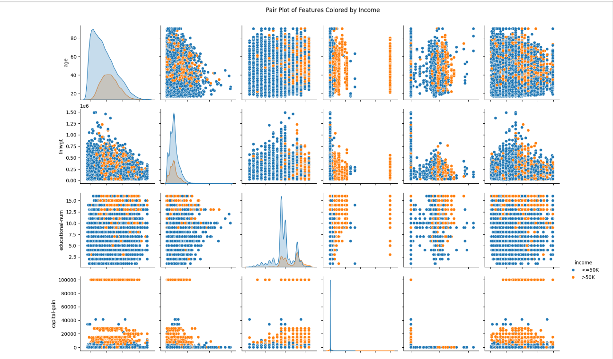
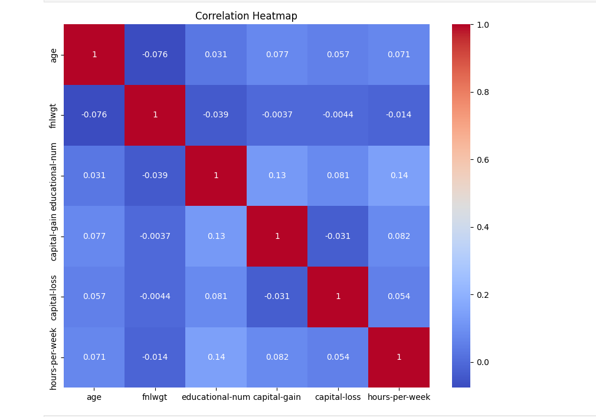

## Predictive Analysis
Predictive Analysis Notebook: https://github.com/umams2002/44688/blob/main/Code/model_building.ipynb

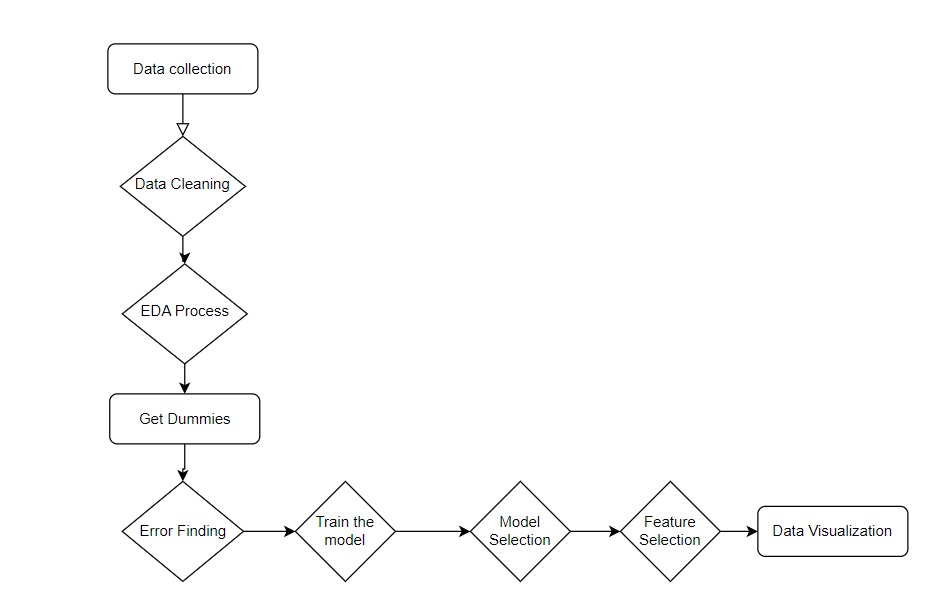

##  Train the Model
Model Selection
This project uses these models for performance and data analysis.
• Logistic Regression
• Multiple Linear Regression
• RandomForestClassifier
• Gradient Boosting
• Support Vector Machine
• K-Nearest Neighbors
• XGBoost
• Lasso Regression
• Decision Tree

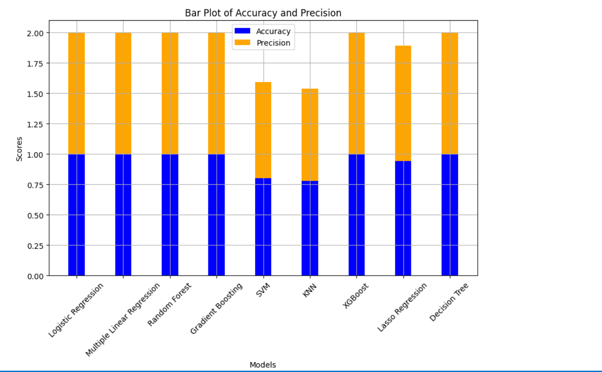 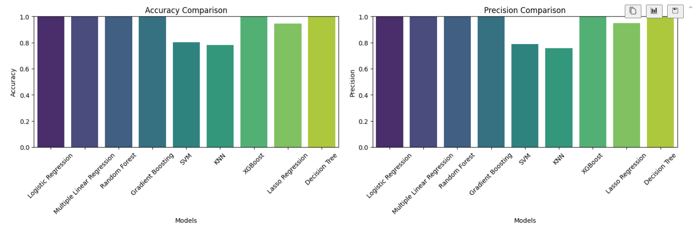 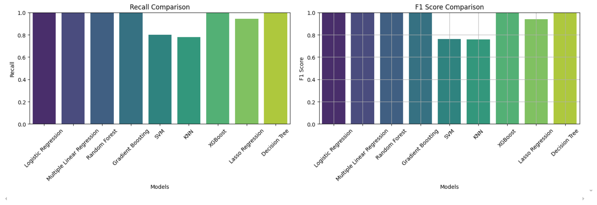 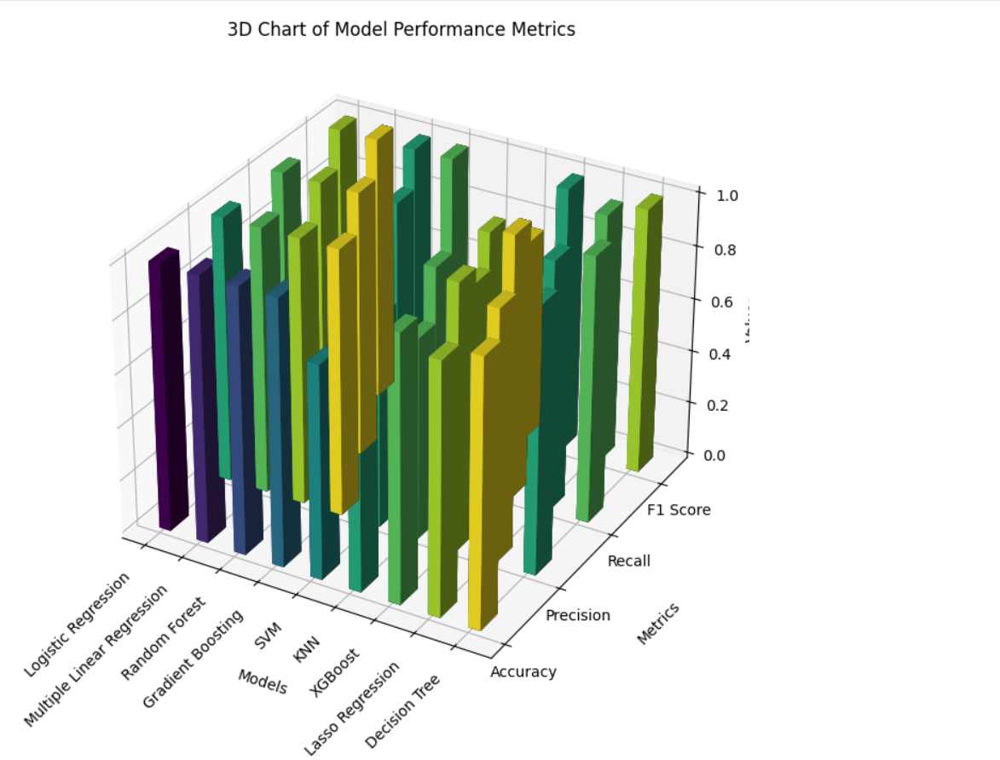

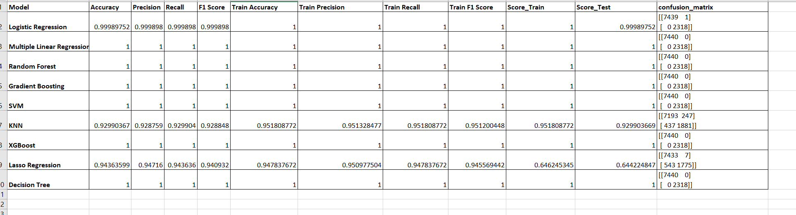
## Features
List of features and functionalities provided by your project.

Forecasts franchise viability based on income levels
Identifies optimal locations for franchise expansion
Provides data-driven insights for business decisions

## Key Finding
The analysis highlights that income prediction is significantly influenced by specific personal and demographic factors. These include age, education level, weekly working hours, and relationship status, underscoring their pivotal role in determining earning potential. The results offer practical insights for customizing policies that alleviate income inequality and promote economic growth. The Income Prediction App was developed to highlight the most important features, insights, and findings in one location.

# Influential Factors in Income Growth:The analysis revealed that key independent variables, including age, number of hours worked per week, education level, and the unique factor relationship status, are significant drivers of income growth. These factors provide actionable insights into understanding income dynamics across different demographics.
# Model Performance and Metrics:The study implemented and evaluated multiple machine learning models, including Random Forest, Gradient Boosting, Support Vector Model, Logistic Regression , Multiple Linear Regression, etc.The models' accuracy, precision, and confusion matrices allowed for a thorough assessment of their predictive power. These metrics substantiate the models' dependability and facilitate their use in practical situations.
# Implications and Justification of Results:The analysis highlights how crucial socioeconomic and demographic factors are in determining income levels. 
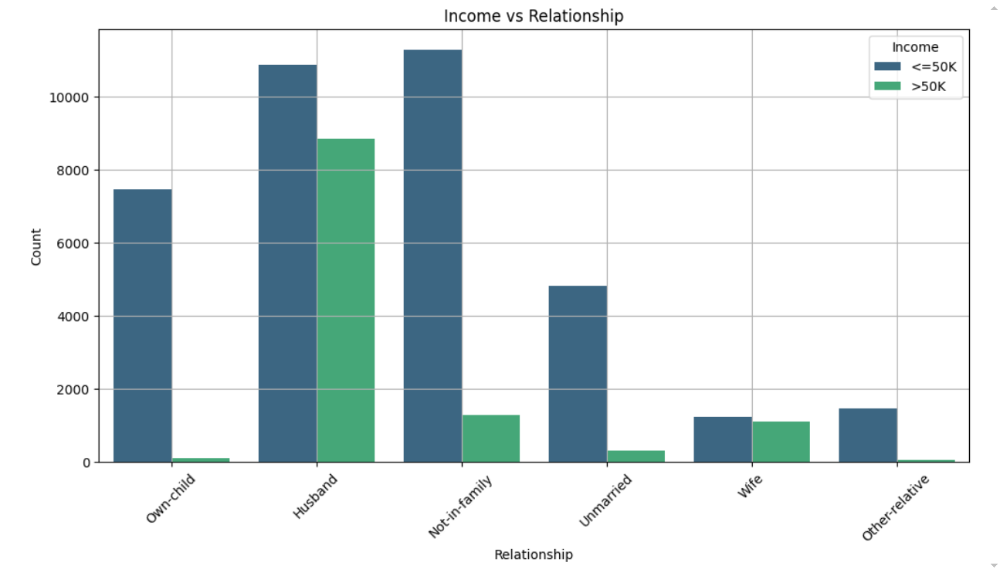
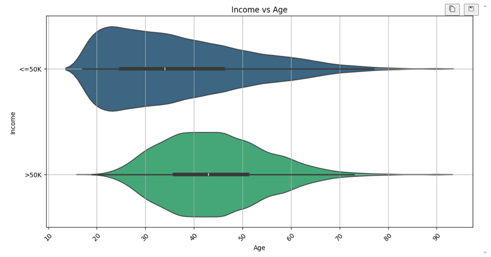
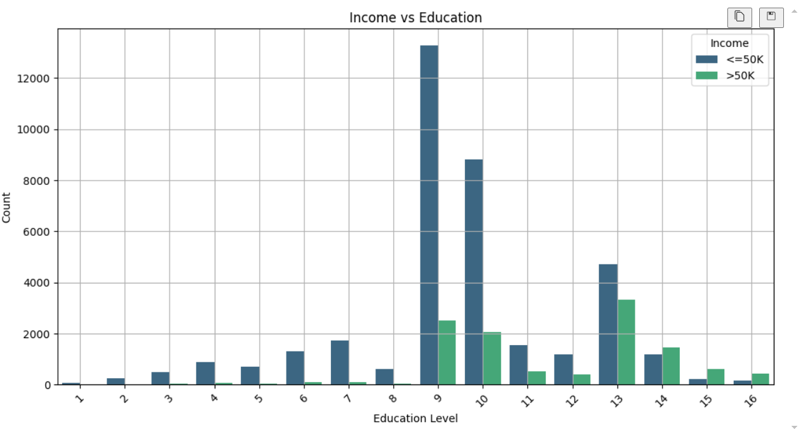
# Identify regions of high-income potential for franchise expansion.
# Guide tax preparation services by targeting demographics and locations with specific income characteristics.
# Offer strategic insights for policy-making and investment decisions, focusing on education and workforce development to enhance income levels

## License
Include the license under which your project is distributed.

This project is licensed under the SUAJ Trading LLC.

## Contact
Provide ways to get in touch with you or the maintainers of the project.

Email: umams2002@gmail.com
GitHub: umams2002

