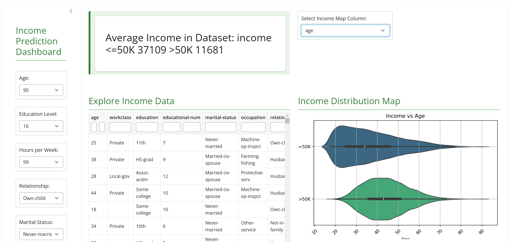

# 44688
CapstoneProject Uma M Subramanian
# Income Prediction in the USA
App Link : https://umams2002.shinyapps.io/incomepredictionapp/
Overleaf Report link: https://www.overleaf.com/read/whfnhmpkgktc#296df2
Github Code Repository link: https://github.com/umams2002/44688


## Description
This project predicts income levels in different regions of the
US to inform strategic business decisions, including selecting suitable
places for franchise expansion for the tax preparation. The predictive models will assist in identifying high-income areas, allowing for the selection of regions for possible franchise expansion.

This research provides valuable forecasts that can assist guide data-driven
business decisions, such as identifying places with income levels that
support franchise viability and success matters.

## Table of Contents
- [Installation](#installation)
- [Usage](#usage)
- [Deliverables] (#deliverables)
- [Features](#features)
- [Key Findings](#key-finding)
- [License](#license)
- [Contact](#contact)


## Installation
Step-by-step instructions on how to install and set up your project.

### Clone the repository
git clone https://github.com/umams2002/44688

### Navigate to the project directory
cd 44688

### Install python latest version
install --py
py --version

### Create and activate environment
py -m venv ds-venv
ds-venv\Scripts\Activate

### Install dependencies
pip install -r [requirements.txt]

## Usage
This project is used for Franchise expansion and Business expansion proposals. It provides valuable forecasts and insights to assist in making data-driven business decisions. Follow the steps below to use the project:

### Running the Project
1. **Activate the virtual environment**:
   ```bash
   ds-venv\Scripts\Activate

## Deliverables
App Link : https://umams2002.shinyapps.io/incomepredictionapp/
Overleaf Report link: https://www.overleaf.com/read/whfnhmpkgktc#296df2
Github Code Repository link: https://github.com/umams2002/44688

## Features
List of features and functionalities provided by your project.

Forecasts franchise viability based on income levels
Identifies optimal locations for franchise expansion
Provides data-driven insights for business decisions

## Key Finding
The analysis highlights that income prediction is significantly influenced by specific personal and demographic factors. These include age, education level, weekly working hours, and relationship status, underscoring their pivotal role in determining earning potential. The results offer practical insights for customizing policies that alleviate income inequality and promote economic growth. The Income Prediction App was developed to highlight the most important features, insights, and findings in one location.


## License
Include the license under which your project is distributed.

This project is licensed under the SUAJ Trading LLC.

## Contact
Provide ways to get in touch with you or the maintainers of the project.

Email: umams2002@gmail.com
GitHub: umams2002